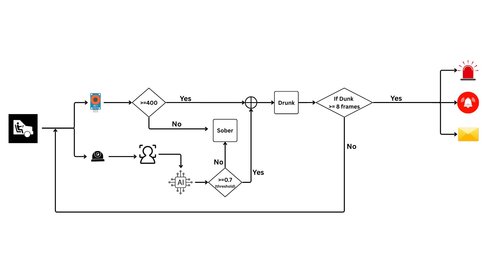
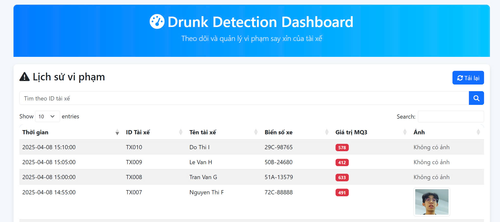
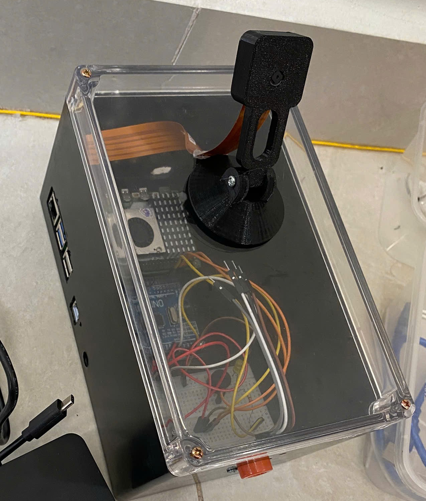

## Introduction

This device detects intoxication from facial images integrate with MQ3 (alcohol sensor). It supports real-time webcam feed processing, single image classification, and batch image processing from folders, displaying "Drunk" or "Not drunk" predictions and send notification.

<p align="center">
  
  <br/>
  <em>Figure 1: Workflow</em>
</p>

## Features

This project provides the following core functionalities:

- Detects signs of intoxication from the driver's facial image using a lightweight deep learning model.
- Triggers physical alerts such as speaker and warning light when intoxication is detected.
- Sends real-time notifications to the user via a messaging platform (e.g., Telegram).
- Logs and manages a history of detected violations with timestamps and image evidence.


<p align="center">
  
  <br/>
  <em>Figure 2: Management Dashboard</em>
</p>

<p align="center">
  
  <br/>
  <em>Figure 3: Demo Device</em>
</p>

## Getting Started

### 1. Clone the repository

```bash
git clone https://https://github.com/ThanhDuy0203/Drunk_Detection_System.git
cd Drunk_Detection_System
```

### 2.Install dependencies

```bash
pip install -r requirements.txt 
```

### 3.Run system

```bash
#Run main.py in RasPi folder
python main.py
```

> **Note**  
>  
> This version is optimized for deployment on Raspberry Pi 5. Please ensure that you are running it on the correct device for best performance.  
>  
> The TFLite model (`DrunkClass_model.tflite`) must be trained for binary classification ("Drunk" vs. "Not drunk") with an input size of **224x224**. Adjust `cv2.resize()` in `main.py` if your model uses a different size.  


